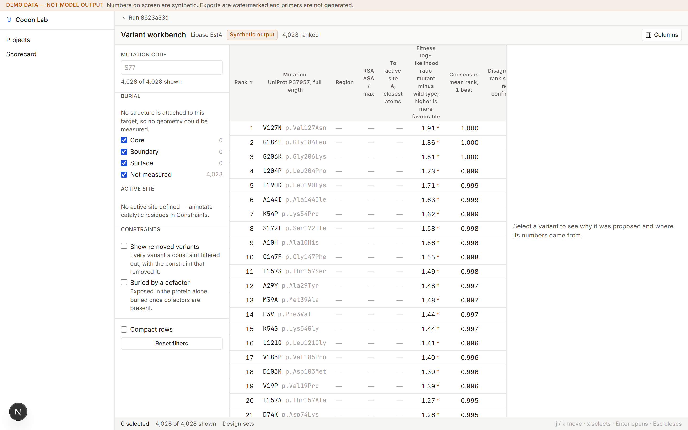
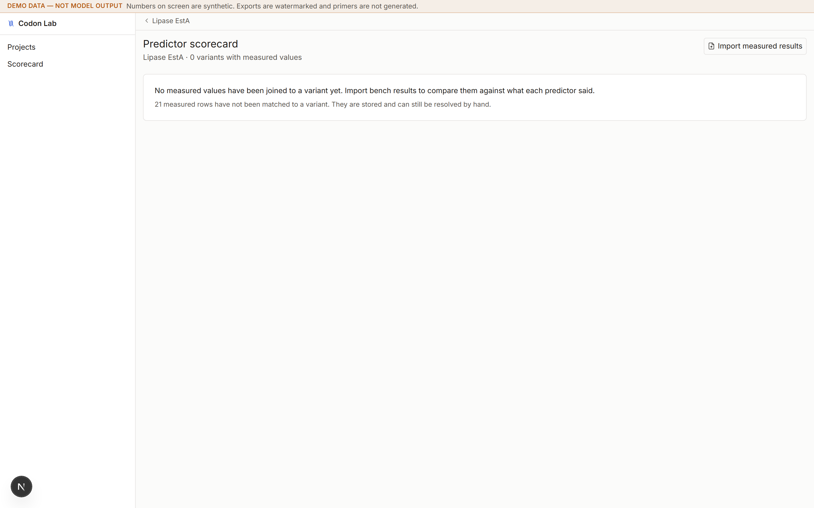
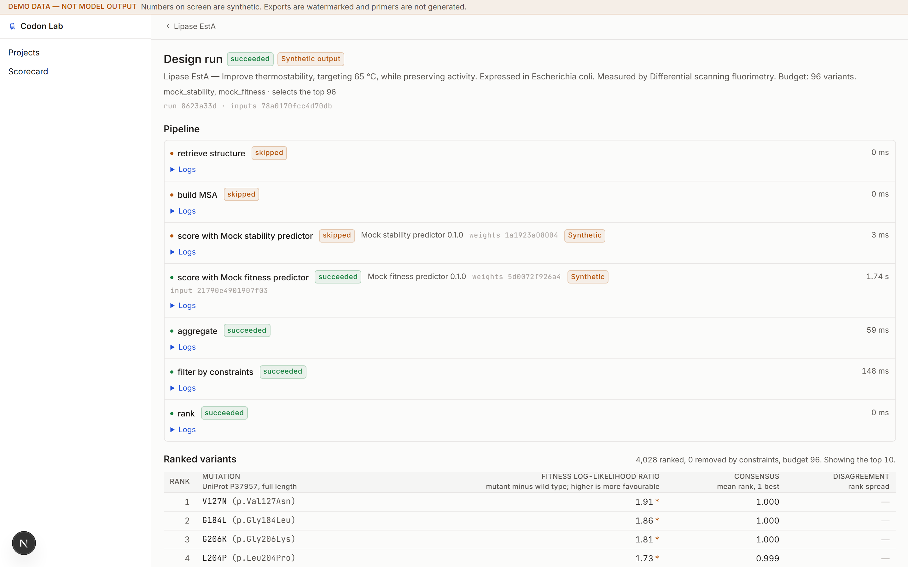

# Codon Lab

Turns a plain-language protein engineering goal into a ranked, defensible list of
specific mutations — and refuses to guess when it does not know.

The models that could help a wet-lab protein engineer — ESM, ProteinMPNN, ThermoMPNN,
RFdiffusion, AlphaFold — are Python repos with CUDA requirements, not tools. So bench
scientists either do not use them, or get a one-off notebook from a computational
colleague, run it once, and never trust the output enough to spend $4,000 of ordering
budget on it.

The gap is not capability. It is **trust**. This is built for someone skeptical, busy,
and correct.

> **Status: Phases 1–9 of 9 built**, with two clauses of the definition of done
> outstanding and named below. Real ESM-2 and ThermoMPNN
> run and are verified; the shipped default is a pair of synthetic providers that badge
> every number they invent. The design set builder, its epistasis warnings, and the
> validation loop — results intake, the join, and the per-predictor scorecard — all ship.
> The **wet-lab handoff does not**: primers are refused, with the reason stated, because
> no target carries a coding DNA sequence to design against.
> [What is and is not verified](#what-is-not-verified) is tracked as carefully as the
> code, because on this project that distinction *is* the product.

---

## The three invariants

Everything else is table stakes. These three are the product, and no change may weaken
them.

### 1. Parse, then confirm — never silently interpret

The user types a goal in English. It is parsed into an explicit structured objective and
shown back as editable chips. **Nothing runs until the user confirms that parse.**

Enforced in `services/goals.require_confirmed` — in the service layer, not on a screen,
because the RQ worker is a second caller and a check that lives only in the UI is a check
the API does not have. A hermetic test drives `runs.create` with a stub session that
raises if anything is read or written before the gate is crossed.

The parser has **no scientific authority**. Every field is optional; an absent field means
"not stated", never a default. A parse that quietly filled in 50 °C because
thermostability usually means about that would be indistinguishable, on screen, from a
number the scientist chose.

### 2. Every number is traceable

Any score traces to which model, which version, which weights hash, which inputs, which
run, at what time — **in two clicks**, counted literally.

Enforced at the database level: `Score.model_version_id` and `Score.run_id` are both
`NOT NULL`, asserted by tests that no future migration may relax. And enforced in the type
system: a `Predictor` returns `ScoreValue`, which carries no run and no model version. It
is *structurally incapable* of producing an untraceable number — only `services/runs` can
turn one into a `Score`, and it cannot do so without both.

`weights_hash` is a SHA-256 over the checkpoint bytes actually loaded. Never a
placeholder: a made-up hash is indistinguishable from a real one in a provenance trail,
which turns the whole claim into a lie.

### 3. Never fabricate a scientific number

Exactly one module in this codebase is permitted to invent a number, and it declares
itself: `providers/mock.py` sets `is_mock`, and that single field raises the persistent
amber bar, badges **every individual number** with a footnoted mark, and will watermark
exports. Nothing downstream recognises a model by name.

Unavailable means `—` with a tooltip explaining why — never an imputed value, never a
blank that could pass for zero. A predictor that cannot run **says so and produces
nothing**; it never falls back to another provider.

---

## Quickstart

Requires Docker. Postgres binds host port **5433** by default (`POSTGRES_PORT` to change
it), because 5432 is often already taken.

```bash
docker compose up -d
```

That runs migrations, seeds, and starts Postgres 17, Redis 7, the FastAPI service, an RQ
worker, and Next.js. Then open <http://localhost:3000>.

Verify the whole thing end to end over HTTP:

```bash
python scripts/verify_gates.py
```

**248 checks** asserting every phase exit gate against a live stack. It seeds its own
projects and targets, so it is idempotent and safe to re-run. A full pass fetches from
UniProt, RCSB and AlphaFold DB and executes real design runs, so it takes a few minutes.

## What it looks like

Captured from a running stack by `pnpm --filter @codonlab/web screenshots`, so they can be
regenerated rather than redrawn. Nothing is cropped: the amber bar is in every application
shot because the seeded providers are synthetic, and hiding it would be the exact
fabrication it exists to prevent.

**The variant workbench** — the main screen. 10,450 ranked substitutions, the numbering
scheme named in the column header, every ΔΔG with its interval and its sign convention,
and every synthetic number carrying its mark.



**The scorecard** — rank, error and bias in one row, with the reason printed where the
error terms cannot be computed.



**The run view** — six stages, each with its model, version, input hash and runtime.



---

### Running the real models

The default is `CODONLAB_PROVIDERS=mock`, so out of the box every number is synthetic and
marked as such. Real predictors are opt-in because PyTorch plus the ESM-2 checkpoint is
several gigabytes:

```bash
cd apps/api && pip install -e ".[models]"
```

Then set `CODONLAB_PROVIDERS=real`. A predictor whose runtime or weights are missing
reports itself unavailable **with the reason**, and the objectives it covered grey out
carrying that same sentence — it does not fall back, and it does not fail silently.

---

## Architecture

```
apps/web         Next.js 15 App Router · React 19 · TypeScript strict · Tailwind v4
apps/api         FastAPI · Python 3.12 · Pydantic v2 · SQLModel · Postgres · RQ
packages/schema  Zod schemas — the ONLY module both apps depend on
```

`apps/web` never imports from `apps/api` and vice versa. They meet at the HTTP boundary
and at the shared schema.

### Layers in `apps/api`

Dependencies point downward only. A module never imports from a layer above it.

```
routes/      HTTP surface. Request/response models. No business logic.
services/    Orchestration: build a run, aggregate scores, apply constraints.
providers/   Predictor implementations. The ONLY place a model client may be imported.
features/    Derived structural features — geometry, not model output. See below.
sources/     External retrieval: UniProt, RCSB, AlphaFold DB, PDB, FASTA.
parsers/     Free-text goal → structured objective. Claude, with a deterministic fallback.
domain/      Pure logic. No I/O, no database. Numbering, mutation codes, aggregation.
models/      SQLModel tables. No behaviour beyond validators.
```

`workers/` sits beside `routes/` as a second entry point at the same level. A job must be
runnable from either without changes — which is exactly why the confirmation gate lives in
`services/`.

### The one rule that shapes everything

> **The UI must never import a model client directly.**

The web app knows about *scores* and *model versions*. It does not know that ESM exists.
Anything that varies by model arrives as **data** — `Capabilities`, `MetricSpec`,
`ModelVersion` rows — never as a branch in a component. Units and sign conventions travel
with the provider, so a second screen cannot contradict the first.

The test for whether this still holds: **adding a fourth stability predictor must touch
zero files under `apps/web/components`.**

---

## The engineering worth reading

### Residue numbering is modelled, not assumed

Off-by-one numbering is the single most expensive error this application can make, and it
is invisible — the output looks perfectly reasonable either way.

On the seeded *B. subtilis* lipase (P37957), UniProt annotates the catalytic nucleophile at
**108** and the structure file's author numbering agrees, while the confirmed mature-protein
scheme calls it **Ser77**. One residue, two numbers, 31 apart — and the viewer addresses it
by one of them while the table shows the other.

So: a target carries *multiple* numbering schemes; reconciliation is a required UI step,
never a silent inference; alignment is never reached automatically (`reconcile()` returns
`NEEDS_ALIGNMENT` and stops); ambiguity is a question, not a coin flip; and schemes are
stored as **one label per position**, not an offset — because Ambler numbering skips
residues, crystal structures leave gaps, and insertion codes are not integers.

Mutation codes are written in the confirmed scheme (`S77A`, not `S108A`). A position the
scheme cannot name produces **no candidate at all** — which is how the signal peptide, which
mature numbering labels zero and below, correctly drops out of the design space.

`domain/schemes.py` resolves sequence index ↔ author numbering as a pure function so it is
testable headlessly. A viewer that renders beautifully on the wrong residue is the worst
failure this app has, and a visual check cannot catch it.

### No validation claim rests on a rank statistic alone

The most general thing this build learned, now a standing rule (`ARCHITECTURE.md` §13).

Agreement with published DSSP output was supposed to validate the van der Waals radii set
in the solvent-accessibility calculation. **It cannot** — a correlation statistic is
invariant to the transform that produces the error it is meant to catch. Measured on TEM-1
(1BTL, 263 residues): swapping ProtOr for a uniform radius moved **8 residues across a
region boundary** while *raising* correlation with DSSP to r = 0.998. The test would have
passed more convincingly while the answer got worse.

Correlation and rank statistics are invariant to monotonic transforms; a systematic offset,
a scale error, and a miscalibration are all monotonic. So a rank statistic is structurally
incapable of detecting the errors most likely to be present.

Consequences, written into the build:

- **Solvent accessibility** ships two tests — DSSP agreement for absolute correctness
  (r = 0.9937 / 0.9954 on 1CRN and 1BTL), plus a golden per-residue table that pins the
  radii set, which the first test provably cannot.
- **The agreement column** is labelled *agreement*, never *confidence*, and its tooltip
  says why: predictors trained on overlapping data share their biases, so agreeing tells
  you the models are alike, not that either is right.
- **The Phase 8 scorecard** reports a rank metric **and** an error metric (MAE) **and** a
  bias term (mean signed error), with bias visually adjacent to rank. A predictor offset
  by a constant +2 kcal/mol scores Spearman 1.00 and precision@10 = 1.0 while being
  useless for the decision the user is actually making, which is absolute. That is not a
  hypothetical: the gate constructs exactly that predictor and asserts it scores
  **ρ = 1.0000** and is caught only by the bias term at **−2.00 kcal/mol**, and
  `scorecard.test.tsx` fails the build if the bias figure is moved out of the row the
  rank figures are in.
- **Where an absolute error cannot be computed, none is shown.** A predicted ΔΔG in
  kcal/mol and a measured T50 in °C are not the same quantity, so the scorecard reads
  `—` and prints the reason beside the rank figure rather than converting between them.
  Opposed sign conventions are refused the same way: the product will not negate one
  series to make two agree.

### Two off-by-ones that shipped, and how they were caught

Both produced entirely plausible numbers. Neither would have been visible in review.

**ESM-2 token alignment.** `_token_offset` returned the *index* of the first residue; the
caller used it as an *additive offset*. Every substitution was scored against its
neighbour. Caught by recomputing masked marginals independently from the same checkpoint
and comparing — `A10W` came out −1.53 where the model actually says −4.59. The fix is
structural: the alignment is established by comparing tokens against the sequence at
several positions across its length, and `score()` re-checks the residue it is about to
mask against the residue the variant names.

**Duplicate scheme labels.** `features/structure.py` built its label→position map with a
dict comprehension, which silently keeps the *last* duplicate. A scheme labelling two
residues alike would have resolved happily to a residue the user never named. Now refused.

### Sign conventions are established, never assumed

ThermoMPNN's ΔΔG direction was determined two independent ways before a single value was
displayed, because getting it backwards inverts every stability recommendation silently:

1. Upstream's own `retrieve_best_mutants` selects the **minimum** predicted ΔΔG as the best
   substitution at a position — so more negative is more stabilizing.
2. On crambin, hydrophobic→charged averages **+0.83** against **+0.42** for
   hydrophobic→hydrophobic.

Both agree on destabilizing-positive, matching `BRIEF.md` §7. No flip is applied, and none
may be added without evidence of the same kind.

### Derived features are as traceable as model scores

RSA, burial class and active-site distance are computed, not predicted — and every
parameter that could make them mean something different is recorded per run in an
append-only `FEATURES_COMPUTED` provenance event:

| Parameter | Value | Why it is pinned |
|---|---|---|
| Reference set | Tien et al. 2013, theoretical | Miller 1987 moves 27 of 1BTL's 263 residues and saturates at RSA 1.00 |
| Radii | ProtOr (Tsai 1999) | Swapping it moves 8 residues, invisibly to a correlation test |
| Probe / points | 1.4 Å / 1000, Fibonacci | No library defaults |
| Cutoffs | core < 0.25, surface > 0.40 | A **project setting**, not a constant — it is a scientific decision |
| Coordinates | as loaded, described as it is | A dimer-interface residue is buried in the assembly and exposed in the monomer |
| Ligands | excluded, with a second pass that flags | The apo calculation makes active-site residues look solvent-exposed |

Distance to the active site is the **minimum non-hydrogen atom separation**, not Cα–Cα: an
arginine side chain reaches ~7 Å past its own Cα, so a Cα measurement would report a
residue as clear of the pocket while its side chain sits inside it. And "the active site"
is exactly the residues the user annotated — no pocket detection, no database lookup, no
heuristic.

### Content addressing and idempotency

Results are cached on `hash(model_version + inputs)`, so a re-run with one parameter
changed re-executes only what that parameter affects — and the run diff is exact rather
than inferred, because it reads stage input hashes rather than guessing.

**Starting a run is idempotent on that same address.** `POST` is not idempotent by default,
so a client retrying after a lost response would otherwise start the same work twice, and
the duplicate would be indistinguishable from a deliberate re-run. Guarded in the service
*and* by a partial unique index — a direct SQL insert bypassing the application is refused
by the database. Failed and cancelled runs leave the index, so retrying after a genuine
failure starts fresh.

---

## The model layer

One `Predictor` protocol, many providers. Every attribute read-only: a predictor's identity
is what the provenance trail is built on.

| Provider | Modality | Offered for | Notes |
|---|---|---|---|
| **ESM-2 650M** | fitness | thermostability, activity, expression, solubility, binding affinity | Masked marginals. Labelled an *evolutionary-plausibility prior*, not evidence for the objective |
| **ThermoMPNN** | stability | thermostability only | Vendored at pinned commit `2b04fd37`, MIT. Requires a structure |
| `mock_stability`, `mock_fitness` | stability, fitness | seven objectives between them | Deterministic synthetic output, correlated through a shared latent. Badged everywhere |

`mock_stability` claims **one** objective on purpose. A mock that claimed all seven would
leave the "grey out what no provider supports" path permanently untested — the unhappy path
has to be reachable in the default configuration or it is not really built.

**ESM-2 is deliberately refused specificity and solvent tolerance.** Its log-likelihood
ratio cannot distinguish substrate selectivity — a variant that switches specificity while
remaining evolutionarily plausible is precisely the case it is blind to — and nothing in
the training distribution was selected for tolerance of a non-natural solvent. ThermoMPNN
is refused solvent tolerance because folding free energy is a different physical property.

Both are offered for thermostability **on purpose**: a sequence-based prior and a
structure-based ΔΔG predictor disagreeing on the same variant is the signal the brief says
to surface rather than average away.

Scores are never averaged. A ΔΔG in kcal/mol and a log-likelihood ratio are not on the same
scale, so each predictor's values become ranks within its own series and only ranks
combine. Disagreement is the spread between them, reported beside the consensus and never
folded into it — and a variant with one opinion gets a **null** disagreement, not zero,
because zero would read as unanimity.

### Measured on this machine (CPU only, no CUDA)

| Checkpoint | Per position | 212 aa target | 550 aa target |
|---|---|---|---|
| `esm2_t33_650M_UR50D` | 3.4s idle / **15.5s under load** | 12 min / **55 min** | 31 min / **142 min** |

The 4.6× gap is CPU contention, and the loaded figure is the real one: a 212-residue run
measured end to end took 3363s.

650M was chosen over 150M because the cost does not recur — the content-addressed cache
makes it per-target, not per-run. See [known gaps](#known-gaps) for the timeout consequence.

---

## Verification

The discipline: **Python tests are hermetic** — no database, no network, no Redis. Anything
that genuinely crosses Postgres is asserted over HTTP in `verify_gates.py`, because that is
the boundary a future caller actually crosses.

```bash
pnpm typecheck && pnpm lint && pnpm test          # 221 vitest, 13 files
cd apps/api && .venv/Scripts/python -m pytest -q  # 399 pass, 6 skipped (opt-in)
cd apps/api && .venv/Scripts/python -m ruff check . && .venv/Scripts/python -m mypy codonlab
python scripts/verify_gates.py                    # 248 checks, live stack
pnpm --filter @codonlab/web e2e                   # 6 Playwright flows, needs the stack
```

The Playwright flows exist for the claims a headless DOM cannot settle: that the run
button is genuinely disabled before a parse is confirmed, that a score reaches its
weights hash in exactly two **trusted** clicks, and that the landing page stays
responsive once its 3D viewer is running. `HANDOFF.md` §8 records a mutation — the
Trace control hidden behind a closed `<details>`, a real third click — that the jsdom
version passes and this one catches.

The third flow exists because the defect it guards actually shipped: an ambient rotation
in the hero viewer cost ~65 ms a frame, which starved the router so completely that the
"Open the workbench" button did nothing at all. The served HTML was correct, so the gate
saw nothing, and jsdom has no frame budget. It took a real browser and a ten-second wait.

The landing page at `/` is a marketing surface with no application chrome, which
is what keeps `BRIEF.md` §4's ban on a marketing hero *inside* the app true. It
carries a live Mol\* model of the seeded lipase, served as a static asset so the
page renders with the API, worker and database all down, and every figure on it
is one this build measured — including the unflattering ones. `DESIGN.md` §13
holds the rules; the three places this goes beyond the brief are listed in
`HANDOFF.md` §6.

The design system is enforced mechanically rather than by discipline:
`apps/web/test/tokens.test.ts` fails the build on a hex literal, an `rgb()`/`hsl()` literal,
an off-scale type size, a stock Tailwind radius, a gradient, `backdrop-blur`, an emoji, a
font weight ≥ 700, a third shadow, or `rounded-full` outside a status dot — and asserts
`DESIGN.md` and `tokens.css` agree on every light-mode colour value, so the two cannot drift.

Tests here are written to **discriminate**, and two were mutation-tested to prove it.
Disabling virtualisation fails all five virtualisation tests. And a mutation pointing every
Trace control at the *first* score passed all six provenance tests that existed at the time
— the gate says "**any** score", and six passing tests did not cover the word. There is now
a two-predictor block that catches it, which is why that gate is worth more than it was.

### What is NOT verified

Tracked in `HANDOFF.md` §5 and stated plainly, because on this project the distinction is
the point.

- **Frame rate.** The Phase 5 gate was rewritten from "10,000 rows scroll at 60fps" to
  *constant work per scroll update*, which **is** asserted in CI: rendering 10,000 rows
  mounts the same number of `<tr>` as rendering 100, total DOM nodes stay flat across that
  hundredfold, and the scroll height equals rows × row height exactly. Separately, measured
  once in a real browser on a 10,450-row ranking (luciferase P08659, 550 residues): 32
  `<tr>`, 772 DOM nodes for the whole page, 0.8ms for a synchronous scroll plus forced
  layout. That is the property 60fps rests on. It is **not** a frame rate, and none is
  claimed — the browser pane an agent drives is hidden, so nothing composites and
  `requestAnimationFrame` never fires. A human with a visible browser must scroll it,
  ideally with Mol\* mounted and holding a WebGL context, the realistic worst case.
- **Mol\*.** It reports `ready` — WebGL initialised, coordinates fetched from our own API,
  parsed, preset applied — and the residue-focus call is wrapped so a failure cannot take
  the panel down. But everything it draws goes to a canvas: nothing about the *image* is
  verified. This is the one thing in the build that cannot be checked from the DOM.
- **The Claude goal parser has never run against the live API.** No key is configured, so
  every parse falls back to the deterministic rule parser and is badged as such. The failure
  branches are covered hermetically against a fake client.
- **The containerised real-provider path.** The images do not carry `[models]`, so
  `CODONLAB_PROVIDERS=real` has never run inside Docker. Both providers were exercised on
  the host venv against the same Postgres, and a full six-stage run completed there.
- **ThermoMPNN's absolute accuracy.** Its position mapping and sign convention are checked;
  its values are compared against no external benchmark.
- **ESM-2 and ThermoMPNN scoring the same run.** Both work individually, and the aggregation
  is unit-tested — but two real predictors disagreeing on one variant has not been observed.
- **No screen has been looked at by a human.** Rendering was verified by reading the DOM
  and, for the Phase 8 screens, by driving them in a real browser and screenshotting the
  result. That establishes *correct*, not *good*; the second judgement has never been made.
- **The scorecard's error and bias terms have never been exercised on real measured data.**
  The seeded measurements are T50 in °C, which is not commensurable with any predictor's
  metric, so on the seeded data MAE and bias correctly read `—` with the reason. The
  computable path is covered hermetically and in the gate with constructed values. Doing
  it for real needs a measured ΔΔG in kcal/mol, and no public dataset was seeded for it
  because none was found whose quantity could be verified to mean the same thing as
  ThermoMPNN's ΔΔG.

### Known gaps


- **A run abandoned mid-flight stays `RUNNING` forever.** `execute()` only claims `PENDING`
  runs and RQ fails its job without writing back. Nothing reaps it, and the idempotency
  index then blocks an identical re-run. A worker heartbeat or a startup sweep is the fix.
- **`JOB_TIMEOUT_SECONDS = 3600` is marginal.** A real run on the 212-residue lipase used
  93% of it. At the observed rate a 550-residue target needs ~142 minutes and would be
  killed. The decision taken is to make the scoring stage resumable rather than raise the
  cap; it is **not built**, and the constant has deliberately not been edited meanwhile.
- **ΔΔG intervals.** `BRIEF.md` §7 requires an interval and ThermoMPNN has no per-variant
  uncertainty to give. It reports the point estimate with the reason stated, rather than
  dressing a benchmark RMSE as a per-variant interval. This leaves the brief's requirement
  formally unmet, and visibly so, which is the honest state. Phase 8 opens a real route to
  closing it — the residual spread the scorecard accumulates is an empirically grounded
  interval — but that needs a stated minimum sample size and is not built.
- **Variants written in a superseded numbering scheme.** Changing a target's canonical
  scheme leaves behind the `Variant` rows the old one produced; they carry scores, so
  nothing deletes them. The Phase 8 join excludes them and reports the count, but no other
  surface defends against them yet.

---

## Deployment

Vercel hosts `apps/web`. It cannot host the rest, and the reason is the worker: a design
run scores every substitution and can take the full `JOB_TIMEOUT_SECONDS` of 3600, while
serverless functions are capped in the low hundreds of seconds on every tier. So the web
app goes to Vercel and the API, worker, Postgres and Redis go to a container host —
`render.yaml` provisions all four in one blueprint.

Two things are enforced at the boundary, because an API behind a URL is a different object
from one on `localhost`:

- **Ownership.** A project belongs to a user, and everything else — targets, runs, scores,
  measurements — reaches its owner through `project_id`. Enforced as a router-level
  dependency rather than per handler, so a route added later cannot forget to opt in. A
  resource somebody else owns answers `404`, not `403`: distinguishing the two confirms
  the row exists and lets an enumerator map the database one id at a time.
- **A ceiling on runs in flight**, not a rate limit. The scarce resource is the worker and
  what consumes it is unfinished runs, so that is what is rationed.

Identity is Clerk, verified against its JWKS — though nothing in the API is
Clerk-specific, so moving to another OIDC provider is an environment-variable swap. Sign
in is a hosted modal; a `user` row appears the first time somebody presents a valid token.
**No credential is stored by this service** — no password hash, no reset token, no session table. This
product holds unpublished sequence data, and every part of password handling that could be
got wrong is left to a service whose business is getting it right.

**The API refuses to start** with `CODONLAB_AUTH=disabled` once `CORS_ORIGINS` names a
non-local origin. That combination serves every project in the database to anyone who
finds the URL, and it has no symptom until it matters.

Full instructions, the environment matrix, and an honest list of what a deployment still
cannot do are in [`DEPLOYMENT.md`](DEPLOYMENT.md).

---

## Status

| Phase | | Verified by |
|---|---|---|
| 1 — Monorepo, Docker, migrations, token layer, primitives | ✅ | `tokens.test.ts` fails the build on any off-system colour or size |
| 2 — Target setup, numbering reconciliation, sequence track | ✅ | Gate: a mutation code is refused until a canonical scheme is confirmed |
| 3 — Constraints, goal composer, confirmable parse | ✅ | Gate: no run starts from an unconfirmed parse |
| 4 — Job queue, `Predictor`, `MockProvider`, run view | ✅ | Gate: a run completes end to end with demo banners correct everywhere |
| 5 — Variant workbench, Mol\*, provenance drawer | ✅ | Gate: two clicks counted with `isTrusted`; constant work per scroll asserted |
| 6 — Real `ESMScorer` + `StabilityPredictor` | ✅ | ESM-2 matched against independent computation; ThermoMPNN sign established two ways |
| 7 — Design sets, epistasis, wet-lab handoff | ◐ | Builder and epistasis warnings ship; exports refuse primers with the reason stated. The handoff itself is blocked on template DNA |
| 8 — Results intake, calibration, scorecard | ✅ | **The moat.** Rank + error + bias, per §13, demonstrated on 2,172 real measured T50 values |
| 9 — Playwright, a11y pass, README, accurate screenshots | ◐ | ⌘K, the `?` sheet, three Playwright flows, the keyboard suite, an enforced contrast audit and regenerable screenshots all ship. Two clauses of §10 remain — see below |

**Phase 8 is the one that matters.** The user uploads measured results from the bench, the
app joins them to predicted variants, and a persistent scorecard accumulates per predictor.
Over three projects the lab learns which predictor to trust for their chemistry.
`BRIEF.md` §2 calls it "the entire moat" — that is the owner's read of the market,
recorded here as their claim rather than a survey this repo has run.

It ships against real data. The build seeds 2,172 measured T50 values for *B. subtilis*
lipase A from ProteinGym's `ESTA_BACSU_Nutschel_2020` (Nutschel et al. 2020,
doi:10.1021/acs.jcim.9b00954), vendored with its SHA-256 and checked byte-identical
against UniProt P37957. Against those measurements, **real ESM-2 650M scores Spearman
ρ = 0.30 where the synthetic predictor scores −0.06** — measured on this machine, not
quoted from a paper.

The join is exact and has no similarity threshold anywhere in it: `A123V` and `A123L`
differ by one character and are different experiments. Where a whole file is written in
another numbering scheme — as the seeded dataset is, by 31 positions — the app proposes
one constant shift, but only when that shift explains **every** unplaced row and no other
shift does, and it never applies one on the user's behalf.

Open scientific decisions are tracked in `HANDOFF.md` §9 and are **never** decided by the
implementation. They are put to the owner; where the owner delegates one back, it is
recorded in `ARCHITECTURE.md` with its reasoning and with what would change it, so a
delegated decision does not decay into folklore. The primer Tm algorithm and its
parameters went that way on 2026-08-25 (`ARCHITECTURE.md` §16.1), and Phase 8's
fuzzy-join rules on 2026-09-01 (`ARCHITECTURE.md` §17.1).

---

## Repository

```
BRIEF.md          The owner's specification, verbatim. Never edited to match the code.
DESIGN.md         Every colour, size, space, radius, shadow, easing — and what is banned.
ARCHITECTURE.md   Module boundaries, the numbering subsystem, delegated decisions.
HANDOFF.md        Status, what is unverified, machine quirks. Rots — trust code over it.

apps/api          10,006 lines + 3,242 lines of tests
apps/web           6,623 lines + 1,774 lines of tests
packages/schema      555 lines — the Zod contract shared by both
scripts/          verify_gates.py — the phase gates, over HTTP

apps/api/codonlab/providers/_vendor/thermompnn
                   1,769 lines, MIT, pinned to one commit, provenance in every
                   file header. Counted separately because it is not ours.
```

`BRIEF.md` is the source of truth. `DESIGN.md` and `ARCHITECTURE.md` are living contracts:
**if the code deviates, the document is updated in the same commit.** `HANDOFF.md` is
status and is expected to rot — the code and tests win.

Commit messages here run 40+ lines on purpose. They carry the reasoning a summarised
conversation loses.

---

## Definition of done

From the brief, and unchanged: keyboard-only users can complete the full flow. Every number
traces to a model version. Nothing in the UI is fabricated. A skeptical PI can read the
exported PDF and reproduce the run. And the app looks like it was made by a design team
that has never heard of a landing page.
